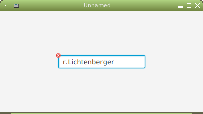
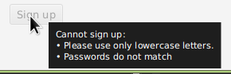

# ValidatorFX

Form validation made easy.

[](https://github.com/effad/ValidatorFX/actions)
[](https://opensource.org/licenses/BSD-3-Clause)


## Introduction
ValidatorFX is a validation library for JavaFX. It is inspired by [ControlsFX](https://github.com/controlsfx/controlsfx) but tries to overcome its shortcomings:
* Validations based on arbitrary observable values (not just the value of a control)
* Validations can decorate an arbitrary number of nodes (not just the one control)
* Validations can decorate any node (not just `Control` subtypes)
* Validations can be done immediately or on-demand (e.g. when clicking a button)

The central class of ValidatorFX is `Validator` which contains a number of `Check`s. As a rule a form will have one `Validator` object and multiple `Check`s.

## Maven Coordinates
```xml
<dependency>
   <groupId>net.synedra</groupId>
   <artifactId>validatorfx</artifactId>
   <version>0.4.0</version>
</dependency>
```

## Example

Heres a minimal complete example of how ValidatorFX is used:

```java

    package net.synedra.validatorfx.demo;

    import javafx.application.Application;
    import javafx.geometry.Pos;
    import javafx.scene.Scene;
    import javafx.scene.control.TextField;
    import javafx.scene.layout.GridPane;
    import javafx.stage.Stage;
    import net.synedra.validatorfx.Validator;

    public class MinimalExample extends Application {

      private Validator validator = new Validator();

      @Override
      public void start(Stage primaryStage) throws Exception {

        TextField userTextField = new TextField();

        validator.createCheck()
          .dependsOn("username", userTextField.textProperty())
          .withMethod(c -> {
            String userName = c.get("username");
            if (!userName.toLowerCase().equals(userName)) {
              c.error("Please use only lowercase letters.");
            }
          })
          .decorates(userTextField)
          .immediate();
        ;

        GridPane grid = createGrid();
        grid.add(userTextField, 1, 1);

        Scene scene = new Scene(grid);		
        primaryStage.setScene(scene);		
        primaryStage.show();		
      }

      private GridPane createGrid() {
        GridPane grid = new GridPane();
        grid.setAlignment(Pos.CENTER);
        grid.setPrefSize(400,  200);
        return grid;
      }

      public static void main(String[] args) {
        launch();
      }
    }
```

Let's look at the central lines which show the fluent API of ValidatorFX:

```java
    validator.createCheck()
```

A new check is created within the validator in this line.    
    
```java    
      .dependsOn("username", userTextField.textProperty())
```

A dependency named `username` is declared here. You can call dependsOn multiple times if you have more dependencies.

```java
      .withMethod(c -> {
        String userName = c.get("username");
        if (!userName.toLowerCase().equals(userName)) {
          c.error("Please use only lowercase letters.");
        }
      })
```

This defines the check to be executed. Note how the dependency declared above can easily be accessed here (of course we could also have used `userTextField.getText()` instead of `c.get("username")` here. 

```java
      .decorates(userTextField)
```

This line tells ValidatorFX to decorate the text field itself. You can call decorates multiple times if you want multiple nodes to be decorated.      

```java
      .immediate();
```

The check is declared immediate by this line which means it will be evaluated constantly and `userTextField` will be decorated as soon as the check condition changes. Without this line you can validate on submit.

Here's a screenshot of the example in action:



To see more features and Details have a look at [ValidatorFXDemo.java](src/test/java/net/synedra/validatorfx/demo/ValidatorFXDemo.java) and the other files in the demo folder.

## Disabling buttons with a tooltip

In many cases a form will contain a submit button that should be disabled if form validation fails. It is important to tell the user about the reason for the button being disabled. This can be done by using a graphic decoration that will display a tooltip if hovered. However this is not very intuitive and the graphic decorations will usually be very small and thus difficult for the user to hover.

Unfortunately disabled nodes cannot show tooltips in JavaFX due to [JDK-8090379](https://bugs.openjdk.java.net/browse/JDK-8090379).

`TooltipWrapper` provides a generic workaround to this problem and can be used either independently or in conjunction with convenience methods from `Validator` as shown in this example:

```java
		TooltipWrapper<Button> signUpWrapper = new TooltipWrapper<>(
			signUp, 
			validator.containsErrorsProperty(), 
			Bindings.concat("Cannot sign up:\n", validator.createStringBinding())
		);
```

this will result in a tooltip like:




